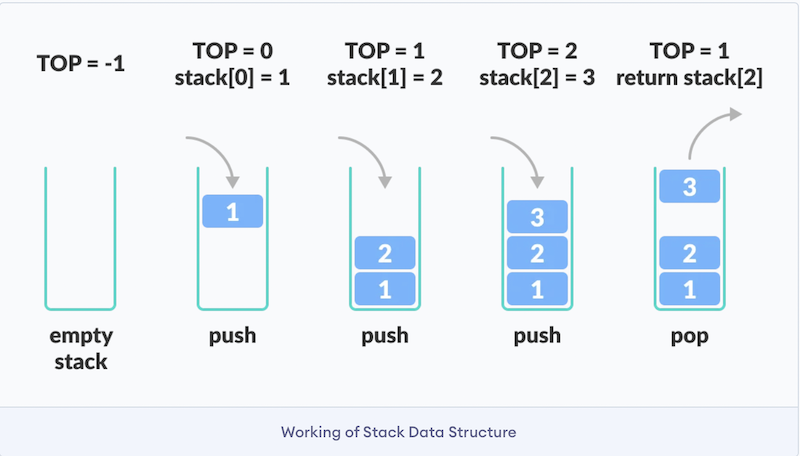

# Stacks

### Projected Time

About 1 hour

### Prerequisites

- [JavaScript](/javascript)
- [Functional programming](/functional-programming/FP.md)

### Motivation

Stack is one of the most commonly used data structure along with its opposite relative, queue. Understanding how to implement stack helps you better understand and describe insertion, removal, and organization of data in a sequential order.

Applications of stack includes:

- An "undo" mechanism in text editors; this operation is accomplished by keeping all text changes in a stack.
- Undo/Redo stacks in Excel or Word.
- Language processing :
  - space for parameters and local variables is created internally using a stack.
  - compiler's syntax check for matching braces is implemented by using stack.
- Back/Forward stacks on browsers.
  [(by Siddhart Mahapatra)](https://www.quora.com/What-are-the-real-life-applications-of-stack-data-structure)

### Objectives

Explain what a stack data structure is and show how it is implemented.

### Specific Things to Learn

- Definition of stack
- Show an example of stack data structure
- JavaScript methods used to implement stack

### Lesson

[Lesson slides](https://docs.google.com/presentation/d/1lOqqqXF-NYzFw0Cu3vIa-dLZeERGhcg1SFmOgW4Y62w/edit#slide=id.p)  
[Lesson video](https://drive.google.com/open?id=1ioFhuH4I0J5gAnwyw6SJxWzioAWKNrZp)

### What is Stack?

A stack is a basic linear data structure, in which the insertion and deletion of items happens at one end called top of the stack. It follows the order of _LIFO (last in first out)_ or _FILO (first in last out)_, the last element added to the stack will be the first element removed from the stack. The classic real-life example for stack is the stack of plates in a buffet, the plate at the top is always the first one to be removed.[^1]

[](https://www.programiz.com/dsa/stack)  
_[Photo credit: programiz](https://www.programiz.com/dsa/stack)_

### Common Mistakes / Misconceptions

- Array and stack seem similar at first glance. While stack can be implemented using array, the data in array can be accessed randomly, whereas stack must be accessed according to order.

### Guided Practice

Explain and discuss as a class the steps involved in writing a stack structure, including:

- Constructor
- Push/Enqueue
- Pop/Dequeue
- Size control

```js
// program to implement stack data structure

// Class stack is declared to initialize an array that will be used to store items of the stack:
class Stack {
  constructor() {
    this.items = [];
  }

  // add element to the stack
  push(element) {
    return this.items.push(element);
  }

  // removes the last item added in the stack:
  pop() {
    if (this.items.length > 0) {
      return this.items.pop();
    }
  }

  // Get the topmost element of the stack
  peek() {
    return this.items[this.items.length - 1];
  }

  // checks whether or not the stack is empty
  isEmpty() {
    return this.items.length == 0;
  }

  // the size of the stack
  size() {
    return this.items.length;
  }

  // empty the stack
  clear() {
    this.items = [];
  }
}
```

You can test the code by creating a new object of Stack class instance and call the methods from it:

```js
let stack = new Stack();
stack.push(1);
stack.push(2);
stack.push(3);
stack.push(4);
console.log(stack.items); // [ 1, 2, 3, 4 ]

console.log(stack.pop()); // 4

console.log(stack.items); // [ 1, 2, 3]

console.log(stack.peek()); // 3

console.log(stack.isEmpty()); // false

console.log(stack.size()); // 3

stack.clear();
console.log(stack.items); // []
```

Runtime Complexity of push() and pop() is Constant time, since we are using the built-in [Array.push](https://developer.mozilla.org/en-US/docs/Web/JavaScript/Reference/Global_Objects/Array/push) and [Array.pop](https://developer.mozilla.org/en-US/docs/Web/JavaScript/Reference/Global_Objects/Array/pop). Both have a runtime of O(1).

### Independent Practice

Try to reverse a string using a JavaScript stack

```js
function reverse(str) {
  let stack = [];
  // push letter into stack

  // implement code here....

  // pop letter from the stack
  let reverseStr = '';

  // implement code here....

  return reverseStr;
}

console.log(reverse('I Love Stack')); // kcatS evoL I
```

### Challenge / Check for Understanding

Find a partner and show each other your own Stack class. Explain how the class you wrote works.

Next, ask each other the following questions:

- What is difference between a stack and a simple array?
- Which method uses LIFO?
- Which methods are used in the stack data structure?
- What is the runtime complexity of a stack?
- How to make simple class as a stack class?
- What is the meaning of '\_' (_underscore_) in the beginning of the variable name? Refer [Playing with data structures in JavaScript — Stack](https://blog.cloudboost.io/playing-with-data-structures-in-javascript-stack-a55ebe50f29d)
- Give some day-to-day examples where stack is used.
- What is difference between stack and queue?

### Supplemental Resources

- [GeeksforGeeks: Implementation of Stack in JavaScript](https://www.geeksforgeeks.org/implementation-stack-javascript/)
- [InitJS: Implement a Stack in JavaScript](https://initjs.org/data-structure-stack-in-javascript-714f45dbf889)

  [^1]: https://betterprogramming.pub/stacks-in-javascript-d2f0e4404eac
